# Tic Tac Toe
I have decided to recreate the iconic childhood game of tic-tac-toe into a Python terminal game, which will be deployed to Heroku.
Users can try to beat the computer by trying to place 3 of their markers in a row, the board will be shown before any moves are made and after each players makes a move.
* Link to the live version can be found [here](https://tic-tac-toe-p3-python.herokuapp.com/).

## Flow Chart
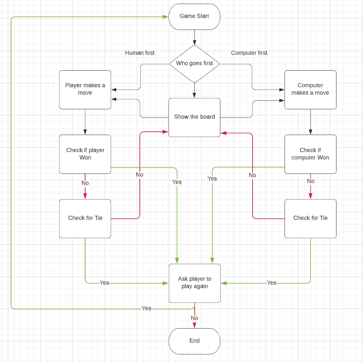

## User Stories
User stories relates to what a user should be able to do and what they might not want to encounter as a player, below are a few examples that I could think of.

### As a User:
* I want to be greeted by a menu.
* I want to be able to read the rules before playing.
* I want to be able to play against a computer player.
* I want to be able to see the board after each move.
* I want to know more about the game before playing.
* I want to play the game again and again.
* I don't want a cluttered screen while playing.

## How To Play
My Python terminal version of tic-tac-toe is based on the childhood pen and paper game. You can read more about it on the [Tic Tac Toe Wiki](https://en.wikipedia.org/wiki/Tic-tac-toe)

The game follows the generic rules or the paper based version.
* The board is drawn out.
* Who goes first is decided.
* The first player makes their move and the board will be shown with their move in place.
* Then the second player will make their move and the board will be shown again.
* Keep alternating moves until one of the players has drawn a row of 3 or until no one can win.

Those are the basic steps of how a single game of tic-tac-toe works.

## Features

### Main Menu
* The main menu feature will consist of 4 options for the user to choose from: 
    * Play Game - starts the game.
    * How to play - explains how the game works.
    * About - explains what tic-tac-toe is.
    * Exit - exits the game.

* The reason for the main menu is to make the project more visually appealing and to allow the user to understand what is happening rather than being thrown directly into the game expected to know what tic-tac-toe is and how to play it.

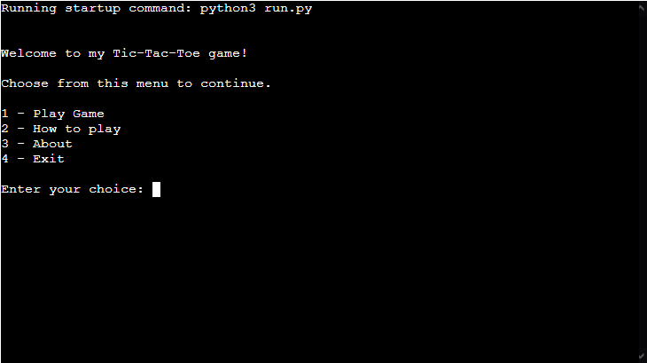

### How to play
* The main purpose of this feature is to explain how the game tic-tac-toe is meant to be played so players will better understand how to play the game and win.

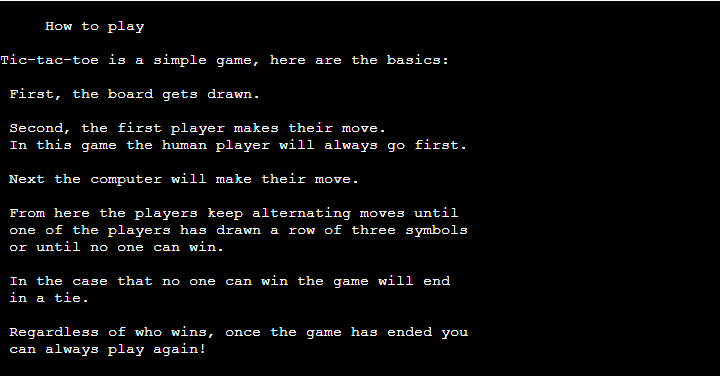

### About
* The purpose of the about section feature is to just go into a bit of detail about what tic-tac-toe is.

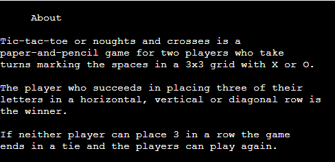

### Exit
* This features sole purpose is to allow the user to exit the game, the exit feature is only presented on the main menu, the user can access the main menu from finishing the game or returning from the about/how to play sections.

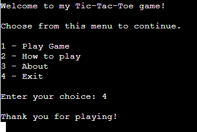

### Menu
* As well as having a main menu I have also included a smaller menu like feature which will allow the user to return to the main menu or play the game.
* This feature is only available when the user goes to the about or how to play section.

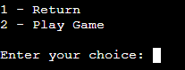

### Board Generation
* The first feature of this project is visually one of the most important aspects, the board, this feature allows the user to see all possible moves they can make without having to keep a mental note of previous moves made by themselves or the computer.

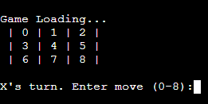

### User Input
* User input is what allows the user/player to input their moves, the players input is limited to only numbers between 0-8 as those are the only available moves on the board.
* With each turn that goes by the user will have less options meaning their input options are also less, any input not valid will throw an error message and ask them to try again.

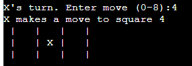

### Board Updates
* Similar to the board generation this feature allows the board to update after each and every move allowing the user to see an updated version of the board so it's even easier to see the next moves.

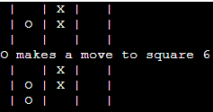

### Computer Player
* This feature allows the user to play against a computer player who randomly generates the moves it makes.

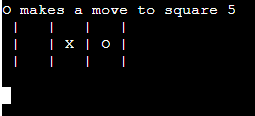

### Check Win
* The check win feature is an important feature that is run after every move to check and recheck if anyone has won, it does this by checking all horizontal, vertical and diagonal winning combonations and returns the results.

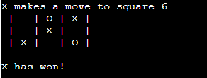

### Check Tie
* The check tie feature is similar to the check win except instead of checking for 3 of the same in a row it simply returns a tie if the check win feature does not return as true.

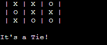

### Invalid Input/Option
* This feature is present whenever the user is prompted to input data.
* The purpose of this is to only allow inputs that work with the game and to ask the user to try again each time they input an invalid data.

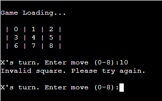
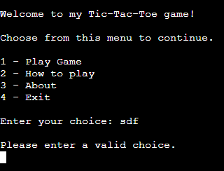

### Play Again
* This feature is simply just the main menu being called at the end of the game, this allows the user to choose to pick from the options they were given at the start.
* I thought this would be better for the user than just the option to play again or exit as they can choose to view the about or how to play section before deciding if they wish to play again or stop playing.

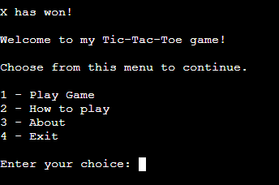

## Technologies Used
During this project I used multiple different technologies to help bring my idea to life, below is a list of the technologies used with a brief explanation.
* [Python](https://wiki.python.org/moin/FrontPage) - This was used for to create the entire project.
* [GitHub](https://github.com/) - GitHub is where all my code was stored and kept in one place.
* [Gitpod](https://www.gitpod.io/) - Gitpod is the environment in which I did all the coding and where the code was built.
* [Heroku](https://www.heroku.com) - Heroku was what I used to deploy the project.

## Data Model
I decided to use several classes for my model, the first classes encountered are the player classes followed by the TicTacToe class which controls all the game functions.

### Player Classes
Within the project I created 3 different classes for the player/s. 
* The first class created would just be the general class for basic player functions.
* The second class was created for the computer controlled player which would take the initial Player class as a variable. This class is seperate to the human player class as it makes the computer randomise their moves.
* The third and final player class is the HumanPlayer class which is what allows the user to play the game, this class checks all available posistions on the board and will only allow the user to place their marker at one of the available squares. If the user tries to go into a square that is not available they will be met with an error message and prompted to enter another valid move.

### TicTacToe Class
The TicTacToe class was created to hold all the functions that make the game.
* This class creates the board that the user will play on while also checking available moves on said board, as well as checking for available moves it also checks the amount of empty squres (this is to help check if the game is tied or not).
* After the board related functions there is the function to actually make the users desired move, once each player makes their move a function to check for a winner is then run. This function will check all possible winning combonations and if either player has one of those combonations on the board this function will end the game and print out the winner to the terminal.

## Testing
### All testing has been done and documented in the TESTING.md file. This includes the PEP8 Validator.

## Deployment
This project was doployed using Code Institute's mock terminal for Heroku.
* Steps for deployment:
    * Sign up for a Heroku account, if you already have one just sign in.
    * Once logged into Heroku go to the dashboard.
    * Click on 'New' -> 'Create New App'.
    * Enter the app name and choose a region (for me this was tic-tac-toe-p3-python and Europe).
    * Click 'Create app'
    * From the 'Deploy' page go across to 'Settings'
    * Find 'Config Vars' and click 'Reveal Config Vars'
    * In the 'KEY' section enter "PORT" and in the 'VALUE' section enter "8000" and click 'Add'
    * Now find 'Buildpacks' on the same page and click 'Add buildpack'
    * Search for and select Python and click 'Save changes'
    * Repeat the last two steps except this time for node.js
    * Now return to the 'Deploy' page and find the 'Deployment method' section
    * Select 'GitHub' this should prompt you to login to your GitHub account
    * Once connected it will ask for a repository to connect to
    * Simply search the repository name, the repositroy should appear below
    * Click 'Connect'
    * From here you can choose either 'Manual deploy' or 'Automatic deploys'
    * To access the deployed link simply click the 'Open app' button located at the top right of your app page.

Alternatively, if using Gitpod, you can click below to create your own workspace using this repository.

## Credits
Throughout this project I used multiple sources to better understand the language I was using and how I could improve my code for an overall better project. All sources will be listed below.

I will also be creditting Code Institute for the deployment terminal.

## Code Related Sources
* Sources that helped me to better understand the code I used:
    * https://stackoverflow.com/questions/13091221/reinitialize-an-object-with-self-init
    * https://www.w3schools.com/python/ref_func_enumerate.asp
    * https://stackoverflow.com/questions/39922967/python-determine-tic-tac-toe-winner
    * https://stackoverflow.com/questions/18884782/typeerror-worker-takes-0-positional-arguments-but-1-was-given
    * https://www.geeksforgeeks.org/clear-screen-python/
    * https://stackoverflow.com/questions/19782075/how-to-stop-terminate-a-python-script-from-running/34029481#:~:text=To%20stop%20a%20running%20program,want%20to%20terminate%20the%20program.&text=Ctrl%20%2B%20Z%20should%20do%20it,caught%20in%20the%20python%20shell.
    * https://realpython.com/python-sleep/

## Content Related Sources
* As I did not create the original game Tic-tac-toe I will be creditting the wiki page for the game itself as the content for my project.
    * https://en.wikipedia.org/wiki/Tic-tac-toe

* The creation of my flow chart was done on the following website:
    * https://www.lucidchart.com/pages/