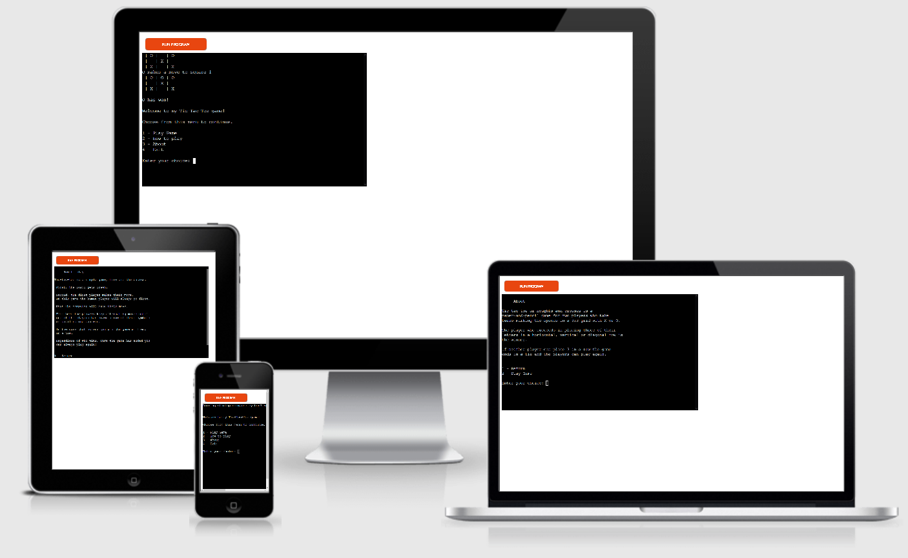
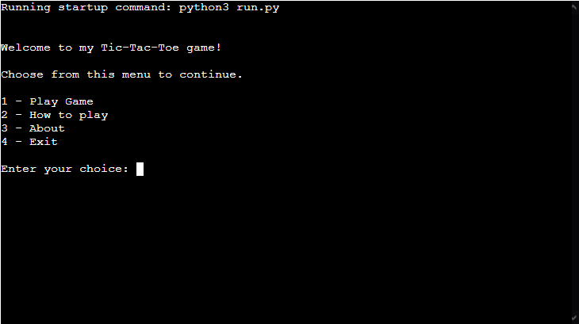
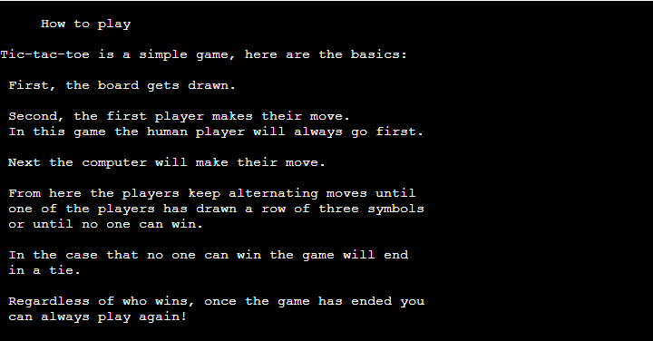
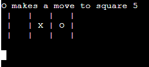
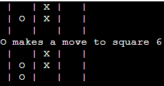
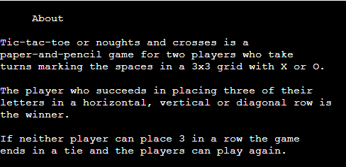
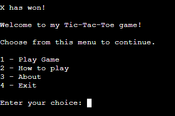
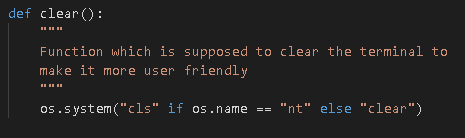
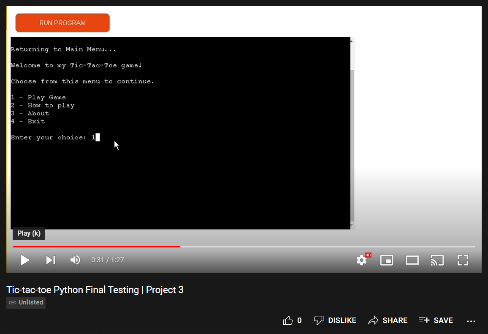
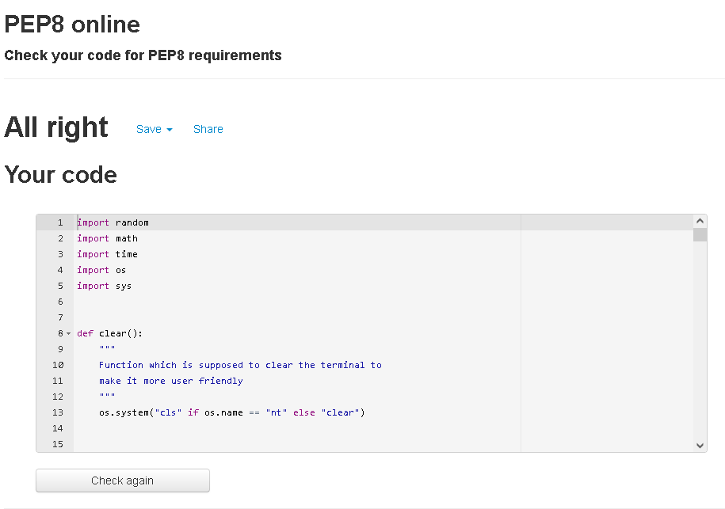

# Tic Tac Toe Testing
Return back to the [README.md](README.md).

The testing process has been broken into two sections; one section as a user to test that everything a user might want from this project works and the other from a more admin focused side in terms of making sure all functions and features work as intended.

## User Story Testing
Testing user stories required me to take a user first approach to the game and think solely about what a user would want to be able to do within this game. Below are the user stories I tested for:

* ### "I want to be greeted by a menu"

* ### "I want to be able to read the rules before playing"

* ### "I want to be able to play against a computer player"

* ### "I want to be able to see the board after each move"

* ### "I want to know more about the game before playing"

* ### "I want to be able to play again at the end of a game"

* ### "I don't want a cluttered screen while playing"

## Feature/Function Testing

I have manually tested this project by doing the following:
* Passed the code through a PEP8 checker and confirmed there are no problems.
* Tested that my project prevents the user from inputting invalid choices/options.
* Tested the code in my local terminal as well as the Code Institute Heroku terminal.
* Tested that the game runs as intended and all features work as planned.

Below is a video of myself playing the game to ensure it all works before my final commit.

## [Final Testing Video](https://www.youtube.com/watch?v=9m8aYx8Dx_E)

## Bugs
While coding my project I had come across a few issues/bugs which have all been fixed. I took note of some of these bugs and issues through the GitHub issue tab and have linked them below.

### Solved Bugs
* The first bug I encountered was a Syntax Error caused by a capitalised while loop. - **Line 32: Syntax Error** Issue [#1](https://github.com/GitHub-Harrison/tic-tac-toe/issues/1)
* The second bug I came across was a TypeError issue where a line of code was missing 1 required positional arguement. - **TypeError: Play() missing 1 required positional argument: 'o_player'** Issue [#2](https://github.com/GitHub-Harrison/tic-tac-toe/issues/2)
* The final issue I encountered was relating to the main menu function, which printed multiple errors to the terminal while I attempted to get it working as planned. - **Main Menu does not work as expected.** Issue [#3](https://github.com/GitHub-Harrison/tic-tac-toe/issues/3)

### Remaining Bugs
* There are no remaining bugs that I am aware of.

## Validator Testing
* PEP8
    * No errors were returned from [PEP8 Validator](http://pep8online.com/)

